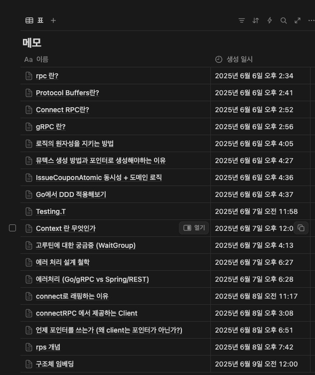

# 쿠폰 발급 시스템 (Coupon Issuance System)

## 과제 개요
지정된 시간에 제한된 수량의 쿠폰을 선착순으로 발급하는 시스템을 구현하는 과제입니다.
동시성 제어와 성능 최적화 문제를 다루며, 실제 서비스에서 발생할 수 있는 상황들을 고려한 설계가 필요합니다.

### 원본 과제 요구사항 (Original Requirements)

**Problem Description**
> You need to develop a coupon issuance system that enables creating campaigns with configurable parameters. Each campaign specifies the number of available coupons and a specific start date and time when coupons can be issued on a first-come-first-served basis.

> The expected traffic immediately after a campaign launch is approximately 500-1,000 requests per second. The system must meet the following requirements:
> - Issue exactly the specified number of coupons per campaign (no excess issuance)
> - Coupon issuance must automatically start at the exact specified date and time
> - Data consistency must be guaranteed throughout the issuance process
> - Each coupon must have a unique code across all campaigns (up to 10 characters, consisting of Korean characters and numbers).

**Basic Requirements**
> - Use connectrpc (https://connectrpc.com/) and go.
> - At least, implement following RPC service and methods:
    >   - CreateCampaign: Create a new coupon campaign
>   - GetCampaign: Get campaign information including all issued coupon codes (only include successfully issued ones)
>   - IssueCoupon: Request coupon issuance on specific campaign

**Challenges**
> - Implement a concurrency control mechanism to solve data consistency issues under high traffic conditions (500-1,000 requests per second).
> - Implement horizontally scalable system (Scale-out)
> - Explore and design solutions for various edge cases that might occur.
> - Implement testing tools or scripts that can verify concurrency issues.

## 기술 스택
- **언어**: Go 1.24.3
- **RPC**: connectrpc
- **프로토콜**: Protocol Buffers
- **동시성 제어**: Go의 sync 패키지 (Mutex, RWMutex)
- **저장소**: 메모리 기반 DB
- **테스트**: Go의 sync/WaitGroup과 채널을 활용한 동시성 테스트

## 프로젝트 구조
```
.
├── cmd/
│   ├── client/                # 데모 클라이언트
│   └── loadtest/              # 부하 테스트 도구
├── gen/coupon/                # Protocol Buffers 생성 코드
├── internal/
│   ├── handler/               # gRPC 핸들러
│   ├── model/                 # 도메인 모델 (DDD)
│   ├── repository/            # 데이터 저장소
│   └── service/               # 비즈니스 로직
├── proto/                     # Protocol Buffers 정의
└── main.go                    # 서버 엔트리포인트
```

## 핵심 구현 사항

### 1. 동시성 제어
#### 캠페인별 뮤텍스
```go
// 캠페인별로 독립적인 뮤텍스를 사용하여 성능 최적화
func (r *MemoryCouponRepository) getCampaignMutex(campaignID string) *sync.Mutex {
  r.campaignMutexLock.Lock()
  
  campaignMutex, exists := r.campaignMutexes[campaignID]
  if !exists {
    campaignMutex = &sync.Mutex{}
    r.campaignMutexes[campaignID] = campaignMutex
  }
  
  r.campaignMutexLock.Unlock()
  return campaignMutex
}
```

#### 원자적 쿠폰 발급
- 락을 활용한 효율적인 동시성 제어
- 캠페인별 독립적인 뮤텍스로 서로 다른 캠페인 간 성능 최적화
- 발급 가능 여부 검증 → 실제 발급 → 상태 업데이트의 원자적 처리

### 2. DDD (Domain Driven Design) 적용
#### 도메인 모델 캡슐화
```go
// internal/model/campaign.go
func (c *Campaign) CanIssueCoupon() (bool, string) {
  c.UpdateStatusIfNeeded()
  
  switch c.Status {
  case pb.CampaignStatus_WAITING:
    return false, "캠페인이 아직 활성상태가 아닙니다"
  case pb.CampaignStatus_ACTIVE:
    if c.IssuedQuantity >= c.TotalQuantity {
      return false, "쿠폰이 모두 소진되었습니다"
    }
  case pb.CampaignStatus_COMPLETED:
    return false, "캠페인이 종료되었습니다"
  }
  
  return true, ""
}
```

- 비즈니스 로직을 도메인 모델에 캡슐화
- 캠페인 상태 관리 및 쿠폰 발급 가능 여부 판단 로직
- 레포지토리는 데이터 접근만, 비즈니스 규칙은 도메인 모델에서 처리

### 3. 고성능 쿠폰 코드 생성
#### 캠페인 기반 + 랜덤 코드 생성
```go
// 캠페인명에서 prefix 추출 + 한글+숫자 조합 랜덤 부분
func (g *CouponCodeGenerator) GenerateCode(campaignName string) (string, error) {
  prefix := g.extractPrefix(campaignName)  // "테스트캠페인" → "테스트"
  randomPart, err := g.generateRandomPart(remainingLength)  // "가나12345"
  return prefix + randomPart, nil  // "테스트가나12345"
}
```

- 캠페인명 기반 의미있는 prefix + 랜덤 부분 조합
- 한글과 숫자 혼합으로 가독성과 유니크성 확보
- 중복 방지를 위한 재시도 메커니즘

### 4. 부하 테스트 도구
#### 고루틴과 채널을 활용한 동시성 테스트
```go
// 워커 풀 패턴으로 동시성 테스트
workQueue := make(chan int, totalRequests)
for i := 0; i < workerCount; i++ {
  go func(workerID int) {
    for requestID := range workQueue {
      // 쿠폰 발급 요청
      req := connect.NewRequest(&coupon.IssueCouponRequest{
        CampaignId: campaignID,
        UserId:     fmt.Sprintf("user-%d-%d", workerID, requestID),
      })
      
      resp, err := client.IssueCoupon(ctx, req)
      // 결과 집계
    }
  }(i)
}
```

- **워커 풀 패턴**: 100개 워커가 1000개 요청을 분산 처리
- **채널 기반 작업 큐**: Go의 채널을 활용한 안전한 작업 분배
- **원자적 카운터**: atomic 패키지로 동시성 안전한 결과 집계

## 테스트 결과

### 동시성 테스트
```bash
# 기본 동시성 테스트 (internal/repository/memory_repository_test.go)
go test ./internal/repository/ -v

=== RUN   TestAtomicCouponIssue
    memory_repository_test.go:58: 동시성 테스트 통과: 20개 요청 중 5개 성공
--- PASS: TestAtomicCouponIssue (0.00s)
```

### 부하 테스트
```bash
# 서버 실행
go run main.go

# 별도 터미널에서 부하 테스트
go run cmd/loadtest/main.go

🚀 쿠폰 발급 부하테스트 시작
설정: 100개 워커가 1000개 요청으로 50개 쿠폰 발급 시도

✅ 부하테스트 완료!
   소요시간: 126.369708ms
   성공: 50개
   실패: 950개
   RPS: 7913
결과 확인:
   발급된 쿠폰: 50개 (예상: 50개)
   캠페인 상태: COMPLETED
✅ 데이터 일관성 확인

```

## 실행 방법

### 1. 서버 실행
```bash
go run main.go
```

### 2. 데모 클라이언트 실행
```bash
go run cmd/client/main.go
```

### 3. 부하 테스트 실행
```bash
go run cmd/loadtest/main.go
```

## 해결한 핵심 도전과제

### ✅ 1. 동시성 제어
- **문제**: 500-1000 RPS 환경에서 정확한 수량만큼만 쿠폰 발급
- **해결**: 캠페인별 독립적인 뮤텍스로 병렬 처리 구현
- **결과**: 1000개 동시 요청에서 정확히 50개만 발급 성공

### ✅ 2. 데이터 일관성
- **문제**: 동시 환경에서 발급된 쿠폰 수와 캠페인 카운터 불일치 가능성
- **해결**: 쿠폰 생성과 카운터 증가를 동일한 락 안에서 원자적 처리
- **결과**: 부하 테스트에서 데이터 일관성 100% 유지

### ✅ 3. 쿠폰 코드 유니크성
- **문제**: 전체 캠페인에서 유니크한 10자 이내 한글+숫자 코드 생성
- **해결**: 캠페인 기반 prefix + 암호학적 랜덤 + 중복 검사
- **결과**: 중복 없는 의미있는 쿠폰 코드 생성

### ✅ 4. 시간 기반 자동 활성화
- **문제**: 지정된 시간에 자동으로 쿠폰 발급 시작
- **해결**: Lazy evaluation 방식으로 요청 시점에 상태 업데이트
- **결과**: 정확한 시간에 캠페인 자동 활성화

## 한계 및 향후 개선 방안

### 현재 한계
1. **메모리 기반 저장소**: 서버 재시작 시 데이터 손실
2. **단일 인스턴스**: 수평 확장 불가
3. **상태 업데이트**: Lazy evaluation으로 인한 지연 가능성

### 수평 확장을 위한 개선 계획
1. 분산 락 도입
   현재는 단일 서버 내 메모리 기반 뮤텍스를 사용하지만, 여러 서버로 확장 시에는 Redis 기반 분산 락이 필요합니다.
2. 이벤트 기반 상태 관리
   현재의 Lazy Evaluation 방식 대신 스케줄러 기반 능동적 상태 변경으로 개선 가능합니다.

## 개발 회고

### 도전과제
- **Go 언어 학습**: Java 배경에서 Go의 고루틴, 채널, 포인터 개념 이해
- **동시성 패턴**: Java의 synchronized와 다른 Go의 뮤텍스 패턴 학습
- **메모리 관리**: GC가 있지만 포인터 사용법과 구조체 임베딩 이해

### 성장 포인트
- **Go 관용구**: 에러 핸들링, defer 사용법, 인터페이스 설계 학습
- **동시성 프로그래밍**: 고루틴과 채널을 활용한 concurrent 패턴 경험
- **ConnectRPC**: Protocol Buffers와 RPC 서비스 구현 경험
- **테스트 주도 개발**: 동시성 이슈를 검증하는 테스트 작성 경험

### 아쉬운 점
- **완전한 분산 환경**: Redis 기반 분산 락 구현은 시간 관계로 미완성 
- 하지만 주어진 시간 내에 Go 언어의 핵심 개념들을 이해하고, 동시성 제어라는 핵심 문제를 해결할 수 있었던 점에서 의미있는 성과라고 생각합니다.

### AI 도구 활용을 통한 학습
Go 언어가 처음이라 Claude를 적극 활용했습니다:
- **문법 학습**: Go의 기본 문법과 관용구 학습
- **개념 이해**: 고루틴, 채널, 뮤텍스 등 핵심 개념을 질문하며 이해
- **코드 리뷰**: AI가 제안한 코드를 읽고 분석하며 동작 원리 파악, 개선점 도출
- **문제 해결**: 동시성 제어 아이디어(락 사용)는 있었으나, Go 문법 한계로 AI의 도움을 받아 정교한 뮤텍스 패턴을 구현
- **구현 검증**: 작성된 코드가 요구사항을 만족하는지 테스트로 확인 
- 완전히 독립적인 설계는 아니었지만, **AI의 도움을 받아 Go 생태계와 동시성 패턴을 빠르게 학습**하고 **요구사항에 맞는 시스템을 구현**할 수 있었습니다.

### 학습 과정 기록
*과제 진행 3일간 학습한 개념들을 체계적으로 정리한 노션 페이지*
- Go 언어가 처음이었기에 각 개념을 하나씩 학습하며 정리했습니다.
- 단순한 문법 암기가 아닌, 왜 이런 설계가 필요한지부터 실제 구현에서의 트레이드오프까지 깊이 있게 탐구했습니다.



## 참고자료
- [Go Concurrency Patterns](https://blog.golang.org/concurrency-patterns)
- [ConnectRPC Documentation](https://connectrpc.com/docs/go/getting-started)
- [Protocol Buffers Go Tutorial](https://protobuf.dev/getting-started/gotutorial/)